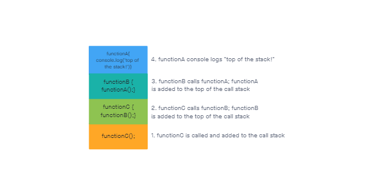

# Class 10 - In Memory Storage

## [Understanding the JavaScript Call Stack](https://medium.freecodecamp.org/understanding-the-javascript-call-stack-861e41ae61d4)

### 1. What is a ‘call’?

A function invocation

### 2. How many ‘calls’ can happen at once?

In JavaScript, only one

### 3. What does LIFO mean?

Last in, first out - that is, the last function that was added to the call stack is the first to be popped out of the stack.

### 4. Draw an example of a call stack and the functions that would need to be invoked to generate that call stack

### 5. What causes a Stack Overflow?

If a function calls itself over and over with no exit point, it will keep adding itself to the call stack infinitely.

## [JavaScript Error Messages](https://codeburst.io/javascript-error-messages-debugging-d23f84f0ae7c)

### 1. What is a ‘reference error’?

Reference errors occur when the code tries to access a variable that hasn't been declared yet.

### 2. What is a ‘syntax error’?

Syntax errors occur when your code uses incorrect syntax, like a `)` when you need a `}`.

### 3. What is a ‘range error’?

Setting an object to an invalid length will create a range error.

### 4. What is a ‘type error’?

Type errors occur when you try to treat a variable as another type of variable (like trying to multiply strings or access the properties of a number).

### 5. What is a breakpoint?

A place you can set for the code to stop, so you can see what's happening at that point.

### 6. What does the word ‘debugger’ do in your code?

If there is debugging functionality available (like breakpoints), the `debugger` statement will add that functionality to the code.

## Things I want to know more about

I need to practice with debugging - console logs only work if the code doesn't break before it gets to them.
