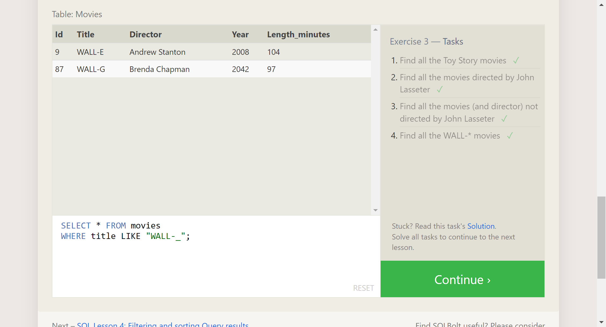

# Learn SQL

SQL (**s**tructured **q**uery **l**anguage) is a language for working with relational databases. Relational databases are made up of tables that hold related information.

- `SELECT` is used to return data from the database
- `FROM` is the table you're trying to get data from
- `ORDER BY` sorts the data
- `LIMIT` sets the number of records to return, and `OFFSET` marks where in the list to start returning from
- `WHERE` sets the criteria the data should match. Can be operated on by `OR` and `AND`.
- `LIKE` can be used to match strings

The database's **schema** is the way it's organized, which data is in what tables, and how those tables relate to each other.

## Practice Screenshots

